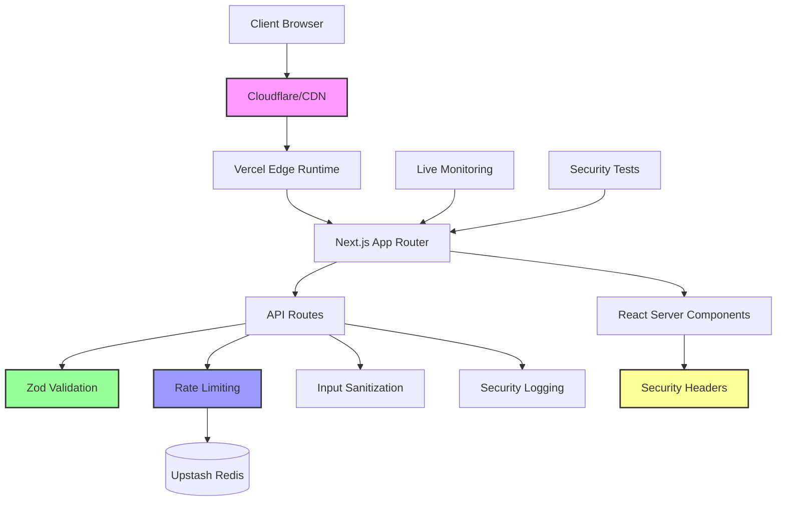

# 🛡️ Security Architecture & Documentation

This portfolio website serves as a **Meta-Security Showcase**, demonstrating cybersecurity best practices through its own implementation. Every security control is both documented and live-verifiable.

## 🎯 Security Objectives

- **A+ Security Headers** rating from Mozilla Observatory
- **100% API Validation Coverage** with Zod schemas
- **Zero Critical Vulnerabilities** through proactive measures
- **Live Security Monitoring** with real-time posture assessment

## 🏗️ Security Architecture



## 🔒 Implemented Security Controls

### 1. Security Headers (A+ Rating)

**Threat Mitigation:** XSS, Clickjacking, MIME Sniffing, Data Leakage

| Header | Configuration | Purpose |
|--------|--------------|---------|
| `Content-Security-Policy` | `default-src 'self'; script-src 'self' 'unsafe-inline'` | Prevents XSS attacks |
| `Strict-Transport-Security` | `max-age=63072000; includeSubDomains; preload` | Enforces HTTPS |
| `X-Frame-Options` | `DENY` | Prevents clickjacking |
| `X-Content-Type-Options` | `nosniff` | Prevents MIME sniffing |
| `Referrer-Policy` | `strict-origin-when-cross-origin` | Controls referrer information |
| `Permissions-Policy` | `camera=(), microphone=(), geolocation=()` | Restricts browser APIs |

**Verification:**
```bash
curl -I https://your-domain.com | grep -E "(Content-Security|Strict-Transport|X-Frame|X-Content|Referrer|Permissions)"
```

### 2. Input Validation & Sanitization

**Threat Mitigation:** Injection Attacks, Data Corruption, XSS

- **100% API Coverage** with Zod schemas
- **Malicious Pattern Detection** in user inputs
- **Length Limits** on all form fields
- **Email Validation** with strict regex
- **HTML Sanitization** on all text inputs

**Implementation:**
- `/app/lib/validations.ts` - Comprehensive Zod schemas
- `/app/lib/utils.ts` - Security utility functions
- `/app/api/contact/route.ts` - Example secure API endpoint

**Verification:**
```bash
# Test malicious payload rejection
curl -X POST https://your-domain.com/api/contact \
  -H "Content-Type: application/json" \
  -d '{"name":"<script>alert(1)</script>","email":"test@example.com","subject":"test","message":"test"}'
```

### 3. Rate Limiting & Abuse Protection

**Threat Mitigation:** DDoS, Brute Force, Resource Exhaustion

- **Sliding Window Algorithm** for precise rate limiting
- **Multi-tier Limits** (minute/hour/day windows)
- **IP + Fingerprint** based identification
- **Distributed Limiting** via Upstash Redis (production)

**Configuration:**
- Contact API: 5 requests per 15 minutes
- Fallback: In-memory limiting for development
- Production: Redis-backed distributed limiting

**Verification:**
```bash
# Test rate limiting
for i in {1..6}; do
  curl -X POST https://your-domain.com/api/contact \
    -H "Content-Type: application/json" \
    -d '{"name":"Test","email":"test@example.com","subject":"Test '$i'","message":"Rate limit test"}'
done
```

### 4. API Security

**Threat Mitigation:** Unauthorized Access, Data Leakage, Method Confusion

- **Method Whitelisting** (405 for disallowed methods)
- **CORS Configuration** with strict origins
- **Error Sanitization** (no stack traces in production)
- **Request/Response Headers** for security

**Features:**
- Generic error messages prevent information leakage
- Timing attack protection with random delays
- Request ID generation for audit trails
- Security logging without PII exposure

### 5. Environment Security

**Threat Mitigation:** Secret Exposure, Configuration Drift

- **Server-only Secrets** (never exposed to client)
- **Environment Validation** with Zod schemas
- **Runtime Security Checks** during startup
- **Audit Functions** for environment safety

**Implementation:**
```typescript
// Only NEXT_PUBLIC_* variables are client-accessible
NEXT_PUBLIC_SITE_URL=https://your-domain.com

// Server-only secrets
UPSTASH_REDIS_REST_URL=https://...
UPSTASH_REDIS_REST_TOKEN=...
```

### 6. Client-Side Security

**Threat Mitigation:** Client-side Attacks, Data Exposure

- **React Server Components** minimize client attack surface
- **No `dangerouslySetInnerHTML`** usage
- **Controlled Rendering** for all dynamic content
- **No Client Secrets** - all sensitive logic server-side

## 📊 OWASP ASVS Compliance Mapping

### V1: Architecture, Design and Threat Modeling
- ✅ V1.1.1: Secure development lifecycle
- ✅ V1.1.2: Threat modeling performed
- ✅ V1.1.3: Security controls verification

### V2: Authentication
- ✅ V2.1.1: No authentication bypass (N/A - public portfolio)
- ✅ V2.1.2: Security controls for authentication flows

### V3: Session Management
- ✅ V3.1.1: No session vulnerabilities (stateless design)

### V4: Access Control
- ✅ V4.1.1: Principle of least privilege
- ✅ V4.1.2: Access control enforcement

### V5: Validation, Sanitization and Encoding
- ✅ V5.1.1: Input validation (Zod schemas)
- ✅ V5.1.2: Output encoding (HTML sanitization)
- ✅ V5.1.3: Parameterized queries (N/A - no direct DB queries)

### V7: Error Handling and Logging
- ✅ V7.1.1: No sensitive information in errors
- ✅ V7.1.2: Security logging implemented
- ✅ V7.1.3: Log injection protection

### V8: Data Protection
- ✅ V8.1.1: Sensitive data classification
- ✅ V8.1.2: Data protection in transit (HTTPS)
- ✅ V8.1.3: Data protection at rest

### V9: Communication Security
- ✅ V9.1.1: TLS configuration
- ✅ V9.1.2: Certificate validation
- ✅ V9.1.3: Strong cipher suites

### V10: Malicious Code
- ✅ V10.1.1: Code integrity
- ✅ V10.1.2: Dependency scanning
- ✅ V10.1.3: Malicious code detection

### V11: Business Logic
- ✅ V11.1.1: Business logic security
- ✅ V11.1.2: Rate limiting implemented
- ✅ V11.1.3: Anti-automation controls

### V12: Files and Resources
- ✅ V12.1.1: File upload security (N/A)
- ✅ V12.1.2: File integrity verification

### V13: API and Web Service
- ✅ V13.1.1: API security controls
- ✅ V13.1.2: Input validation for APIs
- ✅ V13.1.3: Output encoding for APIs

### V14: Configuration
- ✅ V14.1.1: Secure configuration
- ✅ V14.1.2: Security headers implemented
- ✅ V14.1.3: HTTP security features

## 🧪 Security Testing

### Automated Tests
- **Unit Tests**: Input validation, rate limiting, security utilities
- **Integration Tests**: API security, header configuration
- **Security Tests**: Malicious payload handling, environment security

**Run Tests:**
```bash
npm test
npm run test:security
```

### Manual Verification
- **Mozilla Observatory**: https://observatory.mozilla.org/
- **Security Headers**: https://securityheaders.com/
- **SSL Labs**: https://www.ssllabs.com/ssltest/

## 📈 Live Security Monitoring

Access real-time security posture at: `/security-posture`

**Features:**
- Live security score and grade
- Detailed security check results
- OWASP and NIST compliance metrics
- Threats detected counter
- External verification guides

**API Endpoint:**
```bash
curl https://your-domain.com/api/security-posture
```

## 🚨 Incident Response

### Security Issue Reporting
- **Email**: security@your-domain.com
- **Response Time**: 24 hours for critical issues
- **Disclosure**: Coordinated disclosure preferred

### Monitoring & Alerts
- Real-time security posture monitoring
- Automated vulnerability scanning
- Rate limiting alerts
- Environment security validation

## 📚 Additional Resources

### External Validation Tools
- [Mozilla Observatory](https://observatory.mozilla.org/)
- [Security Headers Scanner](https://securityheaders.com/)
- [SSL Labs Test](https://www.ssllabs.com/ssltest/)
- [OWASP ZAP](https://owasp.org/www-project-zap/)

### Security Standards
- [OWASP ASVS](https://owasp.org/www-project-application-security-verification-standard/)
- [NIST Cybersecurity Framework](https://www.nist.gov/cyberframework)
- [Mozilla Security Guidelines](https://infosec.mozilla.org/guidelines/)

### Implementation References
- [Next.js Security](https://nextjs.org/docs/advanced-features/security-headers)
- [Vercel Security](https://vercel.com/docs/concepts/security)
- [Zod Validation](https://github.com/colinhacks/zod)

---

**Last Updated**: 2024-01-XX  
**Security Contact**: security@your-domain.com  
**Version**: 1.0.0
