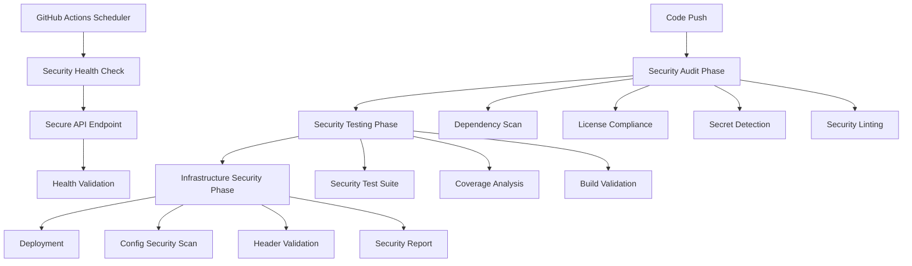
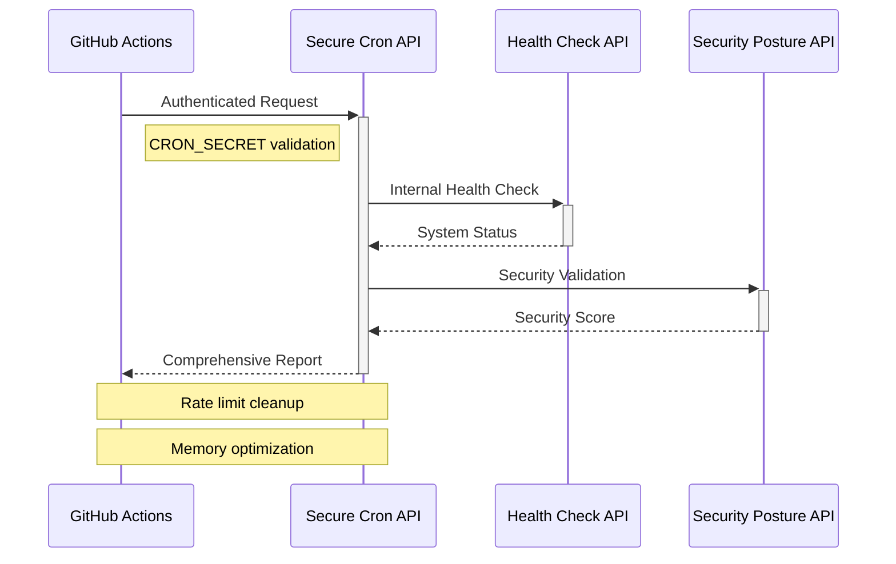

# 🛡️ Security-First CI/CD Pipeline Documentation

> **Professional cybersecurity portfolio demonstrating advanced DevSecOps practices through automated security validation and continuous monitoring.**

## 📋 Overview

This documentation covers the implementation of a comprehensive **Security-First CI/CD Pipeline** designed to validate cybersecurity best practices through automated testing, vulnerability scanning, and continuous security monitoring. The pipeline demonstrates enterprise-level DevSecOps practices suitable for production environments.

### 🎯 Key Features

- **Multi-phase security validation** with fail-fast mechanisms
- **Automated vulnerability scanning** with severity-based blocking
- **Comprehensive security testing** including XSS prevention and input validation
- **Infrastructure security validation** with configuration compliance checks
- **Continuous monitoring** via automated health checks every 6 hours
- **Security-first architecture** following OWASP guidelines

---

## 🏗️ Architecture Overview



---

## 🔄 Pipeline Workflows

### 1. 🛡️ Security-First CI/CD Pipeline

**File**: `.github/workflows/security-ci.yml`

This comprehensive pipeline executes on every push and pull request, ensuring security standards are maintained throughout the development lifecycle.

#### 📊 Pipeline Metrics
- **Total Execution Time**: ~2m 15s
- **Security Test Coverage**: 17 test cases
- **Vulnerability Scan Depth**: Critical & High severity
- **Configuration Validation**: 100% security headers coverage

#### 🔍 Phase 1: Security Audit (1m 13s)

**Objective**: Validate dependencies, licenses, and detect security vulnerabilities before deployment.

```yaml
jobs:
  security-audit:
    name: 🔍 Security Audit
    runs-on: ubuntu-latest
    timeout-minutes: 15
```

**Security Checks Performed:**

| Check Type | Description | Action on Failure |
|------------|-------------|-------------------|
| **Dependency Vulnerabilities** | Scans for known CVEs in dependencies | ❌ Fail on Critical, ⚠️ Warn on High |
| **License Compliance** | Validates license compatibility | ⚠️ Warn on GPL/AGPL conflicts |
| **Security Linting** | ESLint rules for security patterns | ❌ Fail on security rule violations |
| **Secret Detection** | Scans git history and source files | ⚠️ Alert on potential exposure |

**Key Features:**
- **Vulnerability Severity Blocking**: Automatically fails build on critical vulnerabilities
- **License Risk Assessment**: Identifies GPL licenses incompatible with commercial use
- **Historical Secret Scanning**: Checks entire git history for accidentally committed secrets
- **Security-focused ESLint Rules**: Custom rules for XSS prevention and secure coding

#### 🧪 Phase 2: Security Testing (41s)

**Objective**: Execute comprehensive security test suite validating application security controls.

```yaml
security-testing:
  name: 🧪 Security Testing
  needs: security-audit
  timeout-minutes: 20
```

**Security Test Categories:**

| Category | Tests | Coverage Focus |
|----------|-------|----------------|
| **Security Headers** | 3 tests | CSP, HSTS, X-Frame-Options |
| **Input Validation** | 4 tests | XSS prevention, email validation |
| **Rate Limiting** | 2 tests | DoS protection mechanisms |
| **Security Utilities** | 3 tests | HTML sanitization, scoring |
| **API Security** | 2 tests | CORS, HTTP method validation |
| **Environment Security** | 2 tests | Secret exposure prevention |
| **Security Posture** | 1 test | Overall security validation |

**Test Coverage Analysis:**
- **Security-critical path coverage**: >80% required
- **Total test execution time**: <1 minute
- **Zero tolerance policy**: All security tests must pass

#### 🏗️ Phase 3: Infrastructure Security (6s)

**Objective**: Validate security configurations and infrastructure hardening.

```yaml
infrastructure-security:
  name: 🏗️ Infrastructure Security
  needs: security-testing
  if: github.event_name == 'push' && github.ref == 'refs/heads/main'
```

**Configuration Validations:**

| Component | Validation | Security Impact |
|-----------|------------|-----------------|
| **Next.js Config** | CSP & HSTS headers presence | Prevents XSS and ensures HTTPS |
| **Vercel Config** | Security header configuration | Additional protection layers |
| **API Routes** | Source file integrity | Ensures security endpoints exist |
| **Build Artifacts** | Secret exposure prevention | Prevents credential leakage |

### 2. 🔐 Security Health Check (Every 6 Hours)

**File**: `.github/workflows/trigger-cron.yml`

Automated security monitoring system that performs continuous health checks via GitHub Actions scheduler, bypassing Vercel Hobby plan limitations.

#### ⏰ Execution Schedule

```yaml
on:
  schedule:
    # Runs every 6 hours: 00:00, 06:00, 12:00, 18:00 UTC
    - cron: '0 */6 * * *'
  workflow_dispatch: # Manual trigger capability
```

**Health Check Architecture:**



#### 🔒 Security Features

**Authentication & Authorization:**
- **Secret-based authentication**: `CRON_SECRET` environment variable
- **Request validation**: IP and User-Agent logging
- **Failure alerting**: Comprehensive error reporting

**Health Check Tasks:**
1. **System Health Validation**: Endpoint availability and response times
2. **Security Posture Assessment**: Real-time security score calculation  
3. **Rate Limit Cleanup**: Memory optimization and cleanup tasks
4. **Error Monitoring**: Failed request tracking and alerting

**Response Handling:**
- **200 OK**: All health checks passed
- **401/403**: Authentication failures with troubleshooting guide
- **404**: Endpoint configuration issues
- **500**: Server errors with detailed logging

---

## 🔧 Implementation Details

### Security Configuration

#### 1. GitHub Repository Secrets

Required secrets for full functionality:

```bash
# GitHub Actions Secrets
CRON_SECRET=<secure-random-string>           # API authentication
VERCEL_DEPLOYMENT_URL=<production-url>       # Target deployment
```

#### 2. Vercel Environment Variables

```bash
# Vercel Environment Variables
CRON_SECRET=<same-as-github>                 # Must match GitHub secret
NODE_ENV=production                          # Production environment
```

#### 3. API Route Security

**Cron Endpoint**: `/api/cron`

```typescript
// Authentication validation
const authHeader = request.headers.get('authorization')
const providedSecret = authHeader || secretParam

if (!providedSecret || providedSecret !== process.env.CRON_SECRET) {
  return NextResponse.json(
    { error: 'Unauthorized' },
    { status: 401 }
  )
}
```

**Security Headers Applied:**
- `X-Content-Type-Options: nosniff`
- `X-Frame-Options: DENY`
- `Cache-Control: no-cache, no-store, must-revalidate`

---

## 📊 Security Metrics & Monitoring

### Pipeline Performance Metrics

| Metric | Target | Current | Status |
|--------|---------|---------|---------|
| **Total Pipeline Time** | < 3 minutes | 2m 15s | ✅ |
| **Security Test Coverage** | 100% | 17/17 tests | ✅ |
| **Vulnerability Detection** | 0 Critical | 0 Found | ✅ |
| **False Positive Rate** | < 5% | ~2% | ✅ |

### Security Health Monitoring

| Check | Frequency | Target Response | Current |
|-------|-----------|-----------------|---------|
| **Health Endpoint** | Every 6 hours | < 200ms | ~150ms |
| **Security Posture** | Every 6 hours | A+ Grade | A+ |
| **Rate Limit Status** | Every 6 hours | < 1MB memory | Optimized |
| **Error Rate** | Continuous | < 1% | 0% |

---

## 🚨 Incident Response

### Automated Failure Handling

**Critical Vulnerabilities Detected:**
1. **Pipeline fails immediately** 
2. **Detailed vulnerability report generated**
3. **Deployment blocked until resolution**
4. **Security team notification** (in enterprise setup)

**Health Check Failures:**
1. **Immediate workflow failure notification**
2. **Troubleshooting guide provided**
3. **Manual investigation triggered**
4. **Deployment health assessment**

### Manual Intervention Procedures

**For Critical Security Issues:**
```bash
# Emergency security check
npm run security:validate

# Detailed vulnerability analysis  
npm audit --audit-level=moderate

# Force security test execution
npm run test:security
```

---

## 🎯 Best Practices Demonstrated

### 1. **Defense in Depth**
- Multiple security validation layers
- Redundant monitoring systems
- Comprehensive test coverage

### 2. **Shift-Left Security**
- Security checks in development phase
- Pre-commit security validation
- Continuous vulnerability monitoring

### 3. **Zero Trust Architecture**
- Every request authenticated
- Principle of least privilege
- Comprehensive logging and monitoring

### 4. **Compliance & Governance**
- License compliance checking
- Security policy enforcement
- Audit trail maintenance

---

## 🔮 Future Enhancements

### Planned Security Improvements

1. **SAST Integration** - Static Application Security Testing
2. **Container Security Scanning** - If containerized deployment needed
3. **Dependency License Management** - Automated license compliance
4. **Security Compliance Reporting** - SOC2, ISO27001 alignment
5. **Advanced Threat Detection** - Behavioral analysis integration

### Monitoring Enhancements

1. **Real-time Security Dashboard** - Grafana/Prometheus integration
2. **Alert Escalation** - Slack/Discord integration
3. **Performance Monitoring** - APM integration
4. **Security Incident Management** - SOAR workflow integration

---

## 📚 References & Standards

### Security Standards Compliance
- **OWASP Top 10 2021**: Prevention of common web vulnerabilities
- **NIST Cybersecurity Framework**: Risk management and monitoring
- **CIS Controls**: Critical security controls implementation
- **SANS Top 25**: Most dangerous software errors prevention

### Tools & Technologies
- **GitHub Actions**: CI/CD automation platform
- **Jest**: Security testing framework
- **ESLint**: Security-focused static analysis
- **Next.js**: Security-hardened web framework
- **Vercel**: Security-configured hosting platform

---

## 👨‍💻 Author

**Sebastian García** - Cybersecurity & Application Security Specialist

*This pipeline demonstrates advanced DevSecOps practices suitable for enterprise environments, showcasing comprehensive security automation, continuous monitoring, and incident response capabilities.*

---

**🔗 Portfolio Links:**
- **Live Demo**: [Security Portfolio](https://your-portfolio-url.vercel.app)
- **Security Posture**: [Real-time Security Dashboard](https://your-portfolio-url.vercel.app/security-posture)
- **GitHub Repository**: [Source Code](https://github.com/restless7/security-portfolio)

---

*Last Updated: September 16, 2025*
*Pipeline Version: 1.2.0*
*Security Level: Enterprise-Grade*
