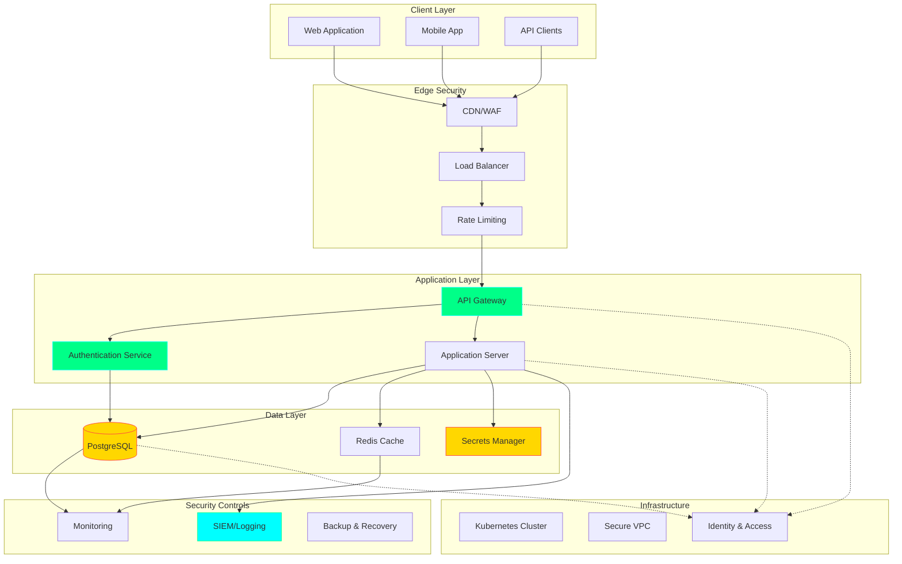
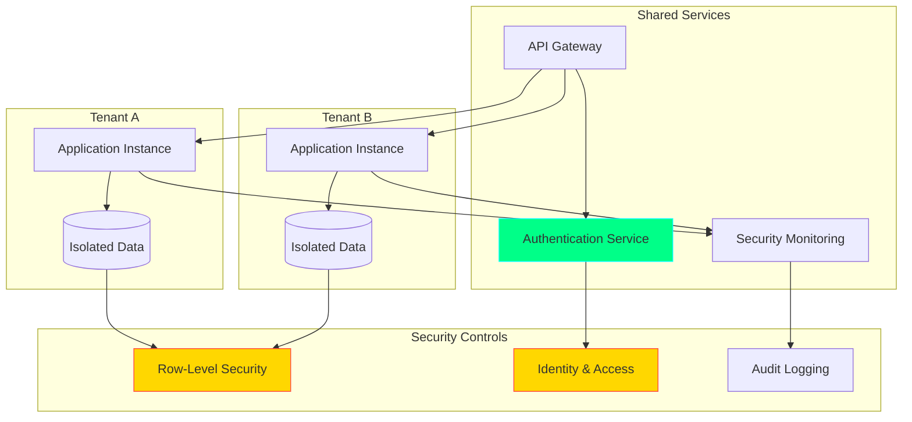
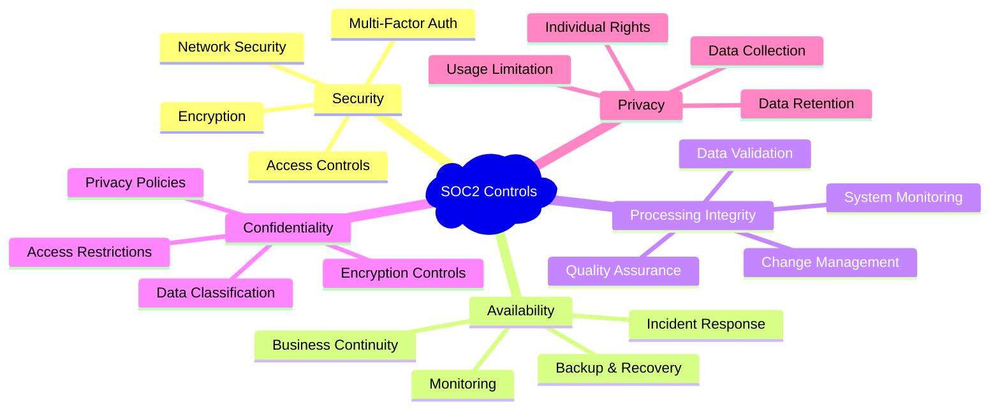

# 🎨 Security-First SaaS - Visual Assets & Design Strategy

**Design Goal**: Professional, authoritative, and technical visual identity that reinforces cybersecurity expertise  
**Brand Colors**: Cyan (#00ffff), Green (#00ff88), Dark Gray (#1a1a1a) - matching your security portfolio  
**Target Aesthetic**: Clean, technical, enterprise-ready with subtle security/hacker elements

---

## 🎯 VISUAL BRAND GUIDELINES

### **Color Palette**
- **Primary**: Cyan (#00ffff) - Trust, technology, precision
- **Secondary**: Green (#00ff88) - Security, success, validation  
- **Accent**: Yellow (#ffd700) - Alerts, attention, premium
- **Warning**: Red (#ff4444) - Vulnerabilities, critical issues
- **Neutral**: Dark Gray (#1a1a1a), Medium Gray (#404040), Light Gray (#cccccc)
- **Background**: Near Black (#0d0d0d), Dark Blue (#0f1419)

### **Typography**
- **Headers**: JetBrains Mono (monospace, technical)
- **Body Text**: Inter (clean, readable)
- **Code**: Fira Code (programming ligatures)
- **Accent**: Orbitron (futuristic, tech-focused)

### **Visual Style**
- **Minimalist**: Clean layouts, plenty of white space
- **Technical**: Terminal/console aesthetics where appropriate
- **Professional**: Enterprise-suitable, not "hacker-stereotype"
- **Data-driven**: Charts, metrics, before/after comparisons
- **Progressive**: Modern UI patterns, subtle animations

---

## 📊 REQUIRED VISUAL ASSETS

### **1. WHITEPAPER DIAGRAMS**

#### **Security Architecture Diagram** (Page 6)
**Mermaid.js Code:**


#### **Attack Surface Analysis** (Page 3)
**Design Elements:**
- Layered security model visualization
- Attack vectors with mitigation strategies
- Risk heat map by component
- Before/after attack surface comparison

#### **Implementation Timeline** (Page 10)
**Gantt Chart Elements:**
- 90-day timeline breakdown
- Parallel security implementation tracks
- Dependencies and milestones
- Resource allocation visualization

### **2. BLOG POST INFOGRAPHICS**

#### **"5 Critical Security Gaps" Visual** (Blog Post 1)
**Design Concept:**
```
[Icon] Authentication Without Authorization
       ↳ Multi-tenant data leakage
       ↳ 73% of breaches involve this gap
       ↳ Impact: $2.4M average cost

[Icon] Infrastructure Security Debt  
       ↳ Default cloud configurations
       ↳ 68% of companies affected
       ↳ Impact: Compliance failures

[Icon] API Security Blind Spots
       ↳ No rate limiting protection
       ↳ 45% increase in API attacks
       ↳ Impact: DDoS vulnerabilities

[Icon] DevOps Without SecOps
       ↳ Secrets in repositories
       ↳ 92% of orgs lack security scanning
       ↳ Impact: Production compromises

[Icon] Compliance Reactive Approach
       ↳ SOC2 as afterthought
       ↳ 84% fail first audit
       ↳ Impact: Lost enterprise deals
```

#### **"7 Pillars Framework" Diagram** (Blog Post 2)
**Circular/Hexagonal Design:**
- Central hub: "Security-First SaaS"
- 7 surrounding pillars with icons
- Connecting lines showing relationships
- Progress indicators for implementation

#### **"DevSecOps Pipeline Flow"** (Blog Post 3)
**Horizontal Flow Diagram:**
- 3-Phase pipeline visualization
- Security gates and checkpoints
- Tool integration points
- Feedback loops and alerts

### **3. GITHUB REPOSITORY VISUALS**

#### **README Header Banner**
**Specifications:**
- Width: 1200px, Height: 400px
- Professional gradient background
- "Security-First SaaS" typography
- Subtle security iconography
- Call-to-action overlay

#### **Repository Structure Visualization**
**Interactive Folder Tree:**
- Color-coded by functionality
- Expandable sections
- Tool/framework icons
- Quick navigation links

#### **Security Score Dashboard Mock-up**
**Dashboard Elements:**
- A+ security rating prominent display
- Vulnerability reduction metrics
- Compliance status indicators
- Security posture trending

### **4. CASE STUDY VISUALS**

#### **Before/After Architecture**
**Split-screen Comparison:**
- Left: Vulnerable architecture (red indicators)
- Right: Secured architecture (green indicators)
- Transformation arrows and annotations
- Security controls overlay

#### **Security Score Improvement**
**Progress Chart:**
- Timeline: 90-day transformation
- Score progression: C- to A+ (96/100)
- Milestone markers
- Business impact annotations

#### **ROI Visualization**
**Investment vs. Return Chart:**
- Implementation costs over time
- Revenue impact from security
- Break-even point analysis
- Enterprise deals enabled

---

## 🛠️ DESIGN TOOLS & WORKFLOW

### **Primary Tools**
1. **Mermaid.js**: Technical diagrams, flowcharts, architecture
2. **Figma**: UI/UX design, presentations, complex graphics
3. **Canva Pro**: Quick infographics, social media assets
4. **D3.js/Chart.js**: Interactive data visualizations
5. **Lucidchart**: Professional architecture diagrams
6. **Adobe Illustrator**: Vector graphics, logos, icons

### **Asset Creation Workflow**
1. **Concept**: Sketch ideas, define requirements
2. **Draft**: Create initial version with placeholder content
3. **Review**: Technical accuracy and brand alignment
4. **Refine**: Professional polish and consistency
5. **Export**: Multiple formats (PNG, SVG, PDF)
6. **Optimize**: Web-ready sizes and loading speed

### **File Organization**
```
visual-assets/
├── brand/
│   ├── logos/
│   ├── color-palette/
│   └── typography/
├── diagrams/
│   ├── architecture/
│   ├── workflows/
│   └── technical/
├── infographics/
│   ├── blog-posts/
│   ├── social-media/
│   └── presentations/
├── charts/
│   ├── metrics/
│   ├── timelines/
│   └── comparisons/
└── templates/
    ├── slide-decks/
    ├── reports/
    └── social-posts/
```

---

## 🎨 SPECIFIC ASSET SPECIFICATIONS

### **Mermaid.js Diagrams for Technical Content**

#### **DevSecOps 3-Phase Pipeline**

```mermaid
flowchart LR
    subgraph "Phase 1: Security Audit"
        A1[Dependency Scan]
        A2[License Check]
        A3[Secret Detection]
        A4[SAST Scan]
    end
    
    subgraph "Phase 2: Security Testing"
        B1[DAST Scan]
        B2[API Testing]
        B3[Container Scan]
        B4[IaC Security]
    end
    
    subgraph "Phase 3: Security Validation"
        C1[Regression Tests]
        C2[Compliance Check]
        C3[Performance Test]
        C4[Deploy Gate]
    end
    
    A1 --> A2 --> A3 --> A4
    A4 --> B1
    B1 --> B2 --> B3 --> B4
    B4 --> C1
    C1 --> C2 --> C3 --> C4
    
    C4 --> D[Production Deploy]
    
    style A1 fill:#00ffff,stroke:#00ff88
    style B1 fill:#00ffff,stroke:#00ff88
    style C1 fill:#00ffff,stroke:#00ff88
    style D fill:#00ff88,stroke:#ffd700
```


#### **Multi-Tenant Security Architecture**


#### **SOC2 Control Implementation Map**


### **Data Visualization Templates**

#### **Security Metrics Dashboard**
**Components:**
- Security Score: Large circular progress indicator (96/100)
- Vulnerability Trend: Line chart showing reduction over time
- Compliance Status: Green checkmarks for completed controls
- Threat Detection: Real-time alert feed
- Performance Impact: Minimal overhead visualization

#### **ROI Analysis Chart**
**Design Elements:**
- Investment timeline (x-axis): 12-month period
- Cost/benefit lines (y-axis): Dollars invested vs. saved
- Break-even point: Clear intersection marker
- Deal attribution: Enterprise deals enabled overlay
- Total ROI: Prominent percentage display

### **Social Media Templates**

#### **LinkedIn Post Template**
**Specifications:**
- Size: 1200x630px
- Brand colors and typography
- Key statistic prominently displayed
- Professional headshot integration
- Call-to-action overlay

#### **Twitter/X Card Template**
**Specifications:**
- Size: 1200x675px
- Simplified color scheme
- Single key message
- Portfolio branding
- Engagement-focused design

---

## 📱 RESPONSIVE DESIGN CONSIDERATIONS

### **Mobile Optimization**
- **Diagrams**: Vertical orientation alternatives
- **Text Size**: Minimum 16px for readability
- **Touch Targets**: 44px minimum for interactive elements
- **Loading**: Optimized image sizes for mobile networks

### **Print Compatibility**
- **Colors**: CMYK alternatives for print materials
- **Resolution**: 300 DPI for professional printing
- **Fonts**: Print-safe alternatives for web fonts
- **Layout**: Page break considerations for reports

---

## 🎯 BRAND CONSISTENCY CHECKLIST

### **Visual Elements**
- [ ] Color palette strictly adhered to
- [ ] Typography consistent across materials
- [ ] Logo/branding properly placed
- [ ] Security-themed iconography used
- [ ] Professional aesthetic maintained

### **Technical Accuracy**
- [ ] Diagrams technically correct
- [ ] Security concepts properly represented
- [ ] Industry terminology used correctly
- [ ] Metrics and data validated
- [ ] Compliance requirements reflected

### **Audience Appropriateness**
- [ ] Executive-level clarity for business content
- [ ] Technical depth for developer content  
- [ ] Professional appearance for enterprise audience
- [ ] Consistent messaging across materials
- [ ] Call-to-actions appropriately placed

---

## 📊 ASSET PRODUCTION TIMELINE

### **Week 1: Foundation**
- [ ] Brand guidelines finalization
- [ ] Template creation (social media, presentations)
- [ ] Core iconography development
- [ ] Color palette and typography testing

### **Week 2: Whitepaper Visuals**
- [ ] Architecture diagrams (Mermaid.js)
- [ ] Timeline and process flows
- [ ] Data visualization charts
- [ ] Before/after comparisons

### **Week 3: Blog Series Graphics**
- [ ] Featured images for each post
- [ ] Infographic creation
- [ ] Code example formatting
- [ ] Social sharing optimized versions

### **Week 4: GitHub & Digital Assets**
- [ ] Repository README graphics
- [ ] Tool screenshots and mockups
- [ ] Interactive diagram exports
- [ ] Video/animation storyboards (optional)

### **Week 5: Marketing Materials**
- [ ] Presentation templates
- [ ] Case study visuals
- [ ] Email template graphics
- [ ] Conference/speaking materials

---

## 🚀 IMPLEMENTATION RESOURCES

### **Free Tools & Resources**
- **Unsplash/Pexels**: Professional stock photography
- **Feather Icons**: Consistent icon library
- **Google Fonts**: Web-safe typography
- **Coolors.co**: Palette generation and validation
- **Figma Community**: Template resources

### **Premium Tools (Recommended)**
- **Canva Pro**: Advanced design capabilities ($15/month)
- **Figma Professional**: Team collaboration ($15/month)  
- **Adobe Creative Suite**: Professional design tools ($60/month)
- **Lucidchart**: Technical diagramming ($10/month)
- **Sketch**: UI/UX design (Mac only, $10/month)

### **Custom Development Options**
- **D3.js Developers**: Interactive data visualizations ($2,000-5,000)
- **Motion Graphics**: Animated explainer videos ($3,000-8,000)
- **Custom Illustrations**: Technical concept art ($1,000-3,000)
- **Interactive Demos**: Security tool mockups ($5,000-15,000)

This comprehensive visual strategy ensures your Security-First SaaS project maintains professional credibility while effectively communicating complex security concepts to your target audience.